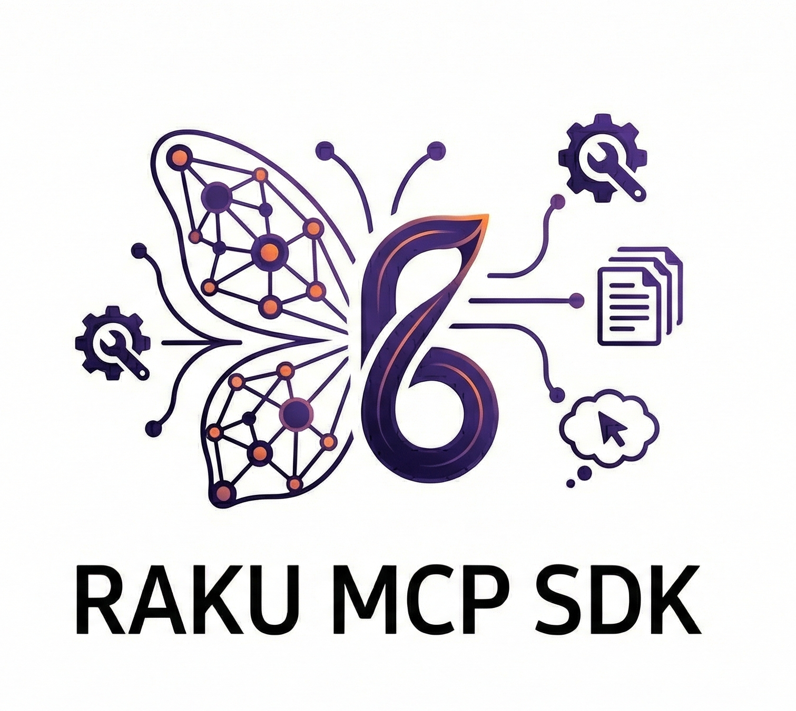
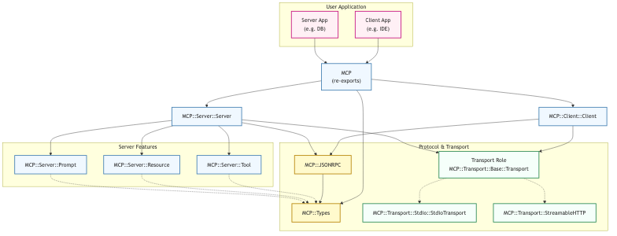

<table>
  <tr>
    <td>
      
    </td>
    <td>
      <p><strong>Raku MCP SDK</strong>: 
      A Raku (Perl 6) implementation of the <a href="https://modelcontextprotocol.io/">Model Context Protocol (MCP)</a> SDK.</p>
      <p>Build MCP servers and clients in Raku to integrate with LLM applications like Claude Desktop, IDEs, and other AI tools.</p>
    </td>
  </tr>
</table>

> **Why Raku**?  
> [Raku](https://raku.org/) is a expressive, multi-paradigm language with strong concurrency tools, a flexible type system, and modern Unicode support. It is well suited for building protocol-first infrastructure where clarity, safety, and rapid iteration matter.

## Status

**Work in progress**

See [Gap Analysis](GAP_ANALYSIS.md) for details on implemented and missing features, in the context of the most recent [MCP specification](https://modelcontextprotocol.io/specification/2025-11-25).

### Implementation Progress

| Feature | Status | Notes |
|---------|--------|-------|
| JSON-RPC 2.0 | ✅ Done | Full message handling |
| Stdio Transport | ✅ Done | Production ready |
| Tools | ✅ Done | List, call, builder API, annotations |
| Resources | ✅ Done | List, read, builder API, annotations |
| Prompts | ✅ Done | List, get, builder API |
| Pagination | ✅ Done | Cursor-based for all list endpoints |
| Logging | ✅ Done | Server-side notifications |
| Progress | ✅ Done | Server-side notifications |
| Cancellation | ✅ Done | Request cancellation with notifications |
| Resource subscriptions | ✅ Done | Subscribe, unsubscribe, update notifications |
| Roots | ✅ Done | Client roots, server list-roots |
| Sampling | ⚠️ Partial | Basic support, missing tools/toolChoice/includeContext/stopReason |
| HTTP Transport | ✅ Done | Full client/server with session management, SSE, resumption |
| Elicitation | ✅ Done | Form and URL modes with handler callbacks |
| Tasks (experimental) | ✅ Done | Async tool execution, status polling, cancellation |
| Extensions framework | ❌ Planned | |
| Completion | ✅ Done | Prompt and resource autocomplete with handler registration |
| Tool output schemas | ✅ Done | `outputSchema` and `structuredContent` for structured results |
| Tool metadata | ❌ Planned | icon metadata + tool name validation guidance |
| OAuth 2.1 | ❌ Planned | OIDC discovery, incremental consent, client ID metadata |

## Table of contents

- [Status](#status)
- [Introduction](#introduction)
  - [MCP](#mcp)
    - [What is it for?](#what-is-it-for)
    - [Design Principles](#design-principles)
    - [Current Status](#current-status)
  - [Raku](#raku)
    - [Design Principles](#design-principles-1)
    - [What is Outstanding? (Unique Features)](#what-is-outstanding-unique-features)
    - [Raku for AI and MCP](#raku-for-ai-and-mcp)
- [Installation](#installation)
- [Quick start](#quick-start)
  - [Creating a server](#creating-a-server)
  - [Using the fluent builder API](#using-the-fluent-builder-api)
  - [Creating a client](#creating-a-client)
- [Features](#features)
  - [Tools](#tools)
  - [Resources](#resources)
  - [Prompts](#prompts)
- [Examples](#examples)
- [Development](#development)
  - [Makefile Targets](#makefile-targets)
  - [Environment Variables](#environment-variables)
  - [Coverage Prerequisites](#coverage-prerequisites)
- [Architecture](#architecture)
- [Project structure](#project-structure)
- [Contributing](#contributing)
- [License](#license)
- [References](#references)
- [Acknowledgments](#acknowledgments)
- [About](#about)

## Introduction

### MCP

**Model Context Protocol (MCP)** is an open standard that standardizes how AI models interact with external data and tools. 
Consider it a "USB-C port for AI applications", a universal interface that replaces the need to build custom connectors for every new data source or tool.

#### What is it for?

It solves the "m-by-n" integration problem. Instead of every AI application (Claude, ChatGPT, IDEs) needing a specific adapter for every data source (Postgres, Google Drive, Slack), they all speak one protocol.

* **Servers** expose resources (data), tools (functions), and prompts.
* **Clients** (AI applications/Hosts) discover and use these capabilities securely.

#### Design Principles

* **JSON-RPC 2.0**: The wire protocol is standard JSON-RPC.
* **Client-Host-Server Architecture**: Clearly separates the Host (the AI app, e.g., Claude Desktop), the Client (the connector inside the host), and the Server (the data provider).
* **Capability Negotiation**: Connections start with an initialize handshake where both sides declare what they support (e.g., resources, logging, sampling).
* **Transport Agnostic**: Designed to run over Stdio (local processes) or HTTP (remote).

#### Current Status

* **Standard**: Released by Anthropic in late 2024; it is now an open standard (managed under the Linux Foundation) supported by major players like OpenAI, Block, and various dev tools (Replit, Sourcegraph).
* **Stability**: The core specification is stable, but transport specifics (specifically the shift to "Streamable HTTP") have evolved recently (circa early 2025) to simplify deployment.
* **Specification**: See the most recent [specification version 2025-11-25](https://modelcontextprotocol.io/specification/2025-11-25).

### Raku

Raku (formerly Perl 6) is a high-level, multi-paradigm programming language optimized for expressiveness, modularity, and consistency. 
It is a specification-driven language (with Rakudo being the primary implementation) that encourages "programming as a human language"—allowing code to be written in a way that feels natural and context-aware rather than rigid and machine-like.

#### Design Principles

Raku preserves the spirit of Perl ("There Is More Than One Way To Do It") but rebuilds the foundation entirely. Its core principles include:

* **Context Sensitivity**: Symbols and operators adapt based on context (e.g., string vs. numeric context), similar to natural language.
* **Multi-Paradigm**: It does not force a style. It natively supports Object-Oriented, Functional, Concurrent/Reactive, and Procedural programming equally well.
* **Gradual Typing**: You can write quick "scripty" code with dynamic types, or large-scale robust applications with strict static types, all in the same file.
* **Unicode at the Core**: Raku assumes Unicode by default, treating characters as graphemes (user-perceived characters) rather than simple bytes, preventing common text-processing bugs.

#### What is Outstanding? (Unique Features)

Raku offers features that are often libraries or "hacks" in other languages as first-class citizens:

* **Grammars**: This is arguably Raku's "killer feature." Instead of unreadable Regex strings, Raku allows you to define formal grammars as classes. You can parse complex files (JSON, XML, custom DSLs) natively without external tools like Lex or Yacc.
* **Junctions**: You can treat multiple values as a single entity using quantum-like superposition.
* **Rational Arithmetic**: By default, 0.1 + 0.2 equals exactly 0.3. Raku uses rational numbers (fractions) instead of floating-point math for decimals, eliminating rounding errors common in Python or JavaScript.
* **Meta-Object Protocol (MOP)**: Raku exposes its own object system to the developer. You can hook into class creation, method dispatch, and inheritance at runtime, allowing for powerful metaprogramming.
* **Concurrency**: It has high-level primitives for concurrency that are safer than threads. It distinguishes between Parallelism (using multiple cores for speed) and Concurrency (managing shared state) using tools like Promises, Supplies (Reactive UI), and Channels.

#### Raku for AI and MCP

Raku is a "sleeper" choice for specific AI domains, particularly those involving language and orchestration.

**Suitability for AI**:

* **Symbolic AI and NLP**: Raku excels here. Its Grammars engine makes it perhaps the best language in existence for cleaning, parsing, and restructuring messy text data before feeding it into a model.
* **Data Pipelines**: Its functional chains and concurrency support make it excellent for building "glue" code that orchestrates data movement between models.
* **Weakness**: It lacks the massive ecosystem of numeric tensors and GPU acceleration found in Python (PyTorch/TensorFlow). You would likely use Raku to prepare data or orchestrate agents, rather than training the neural network itself.

**Interfacing through MCP (Model Context Protocol)**: Raku is surprisingly well-architected for the Model Context Protocol (MCP), which connects LLMs to external tools and data.

* **Introspection**: MCP requires tools to describe their own schemas (inputs/outputs) to the AI. Raku's deep introspection (MOP) and signature objects allow you to auto-generate these JSON schemas directly from your function definitions.
* **Gradual Typing**: MCP relies on structured data exchange. Raku's strong type system can validate AI-generated JSON inputs automatically, rejecting hallucinations before they hit your business logic.
* **Asynchrony**: MCP is often conversational and event-driven. Raku's React / Supply blocks (reactive programming) map perfectly to handling streams of requests from an AI agent.

## Installation

```bash
# From zef (once published)
zef install MCP

# From source
git clone https://github.com/your-username/raku-mcp-sdk
cd raku-mcp-sdk
zef install .
```

## Quick start

### Creating a server

```raku
use MCP;
use MCP::Server;
use MCP::Transport::Stdio;
use MCP::Types;

# Create server
my $server = MCP::Server::Server.new(
    info => MCP::Types::Implementation.new(
        name => 'my-server',
        version => '1.0.0'
    ),
    transport => MCP::Transport::Stdio::StdioTransport.new,
);

# Add a tool
$server.add-tool(
    name => 'greet',
    description => 'Greet someone by name',
    schema => {
        type => 'object',
        properties => {
            name => { type => 'string', description => 'Name to greet' }
        },
        required => ['name'],
    },
    handler => -> :%params {
        "Hello, %params<name>!"
    }
);

# Add a resource
$server.add-resource(
    uri => 'info://about',
    name => 'About',
    description => 'About this server',
    mimeType => 'text/plain',
    reader => { 'This is my MCP server!' }
);

# Start serving
await $server.serve;
```

### Using the fluent builder API

```raku
use MCP::Server::Tool;

# Build tools with fluent API
my $calculator = tool()
    .name('add')
    .description('Add two numbers')
    .number-param('a', description => 'First number', :required)
    .number-param('b', description => 'Second number', :required)
    .annotations(title => 'Calculator', :readOnly, :idempotent)
    .handler(-> :%params { %params<a> + %params<b> })
    .build;

$server.add-tool($calculator);
```

### Creating a client

```raku
use MCP;
use MCP::Client;
use MCP::Transport::Stdio;
use MCP::Types;

# Connect to an MCP server process
my $proc = Proc::Async.new('path/to/mcp-server');
my $client = MCP::Client::Client.new(
    info => MCP::Types::Implementation.new(
        name => 'my-client',
        version => '1.0.0'
    ),
    transport => MCP::Transport::Stdio::StdioTransport.new(
        input => $proc.stdout,
        output => $proc.stdin,
    ),
);

await $client.connect;

# List and call tools (with pagination support)
my $tools-result = await $client.list-tools;
for $tools-result<tools> -> $tool {
    say "Tool: $tool.name() - $tool.description()";
}
# Use $tools-result<nextCursor> for pagination if present

my $call-result = await $client.call-tool('greet', arguments => { name => 'World' });
say $call-result.content[0].text;  # "Hello, World!"

# Read resources
my @contents = await $client.read-resource('info://about');
say @contents[0].text;
```

## Examples

The `examples/` directory contains runnable, minimal reference implementations that demonstrate common MCP SDK patterns. Use them to quickly validate your environment, see how transports and handlers fit together, and copy a solid starting point for your own servers and clients.

To list available examples:

```
# execute without naming any example
make run-examples

Available examples:
  • advanced-client      # In-process loopback covering pagination, completions, roots, and elicitation
  • advanced-server      # Pagination, resource subscriptions, and cancellation
  • http-server          # Streamable HTTP server transport
  • sampling-client      # Client-side sampling handler
  • simple-server        # Stdio server with tools, resources, and prompts
```

Run any example with:

```bash
# execute naming an example
make run-example EXAMPLE=advanced-server

→ Running example: advanced-server...

== Pagination ==
Page 1 tools: tool-beta, tool-epsilon
Page 1 nextCursor present: yes
Page 2 tools: tool-alpha, tool-delta
Page 2 nextCursor present: yes

== Resource Subscriptions ==
Subscribe result keys: 
Update notifications sent: 1
Last notification method: notifications/resources/updated

== Cancellation ==
Marked cancelled: yes
Responses sent after cancellation: 0

Done.
```

## Features

### Tools

Tools are functions that the LLM can call.

```raku
$server.add-tool(
    name => 'search',
    description => 'Search for something',
    schema => {
        type => 'object',
        properties => {
            query => { type => 'string' },
            limit => { type => 'integer', default => 10 },
        },
        required => ['query'],
    },
    handler => -> :%params {
        # Return string, Content object, or CallToolResult
        my @results = do-search(%params<query>, %params<limit>);
        @results.join("\n")
    }
);
```

### Resources

Resources provide read-only data.

```raku
# Static resource
$server.add-resource(
    uri => 'config://app',
    name => 'App Config',
    mimeType => 'application/json',
    reader => { to-json(%config) }
);

# File-based resource
use MCP::Server::Resource;
$server.add-resource(file-resource('data.txt'.IO));
```

### Prompts

Prompts are templated message workflows.

```raku
use MCP::Server::Prompt;

$server.add-prompt(
    name => 'summarize',
    description => 'Summarize content',
    arguments => [
        { name => 'content', required => True },
        { name => 'length', required => False },
    ],
    generator => -> :%params {
        my $length = %params<length> // 'medium';
        user-message("Please provide a $length summary of: %params<content>")
    }
);
```

## Development

The project uses a comprehensive Makefile for development tasks:

```bash
make about       # Show project information
make all         # Full build: dependencies → build → test
make test        # Run test suite
```

### Makefile Targets

<table>
  <thead>
    <tr>
      <th align="left">Target</th>
      <th align="left">Description</th>
      <th align="left">Notes</th>
    </tr>
  </thead>
  <tbody>
    <tr><th colspan="3" align="left">Primary targets</th></tr>
    <tr><td><code>all</code></td><td>Install deps, build, and test</td><td>Runs <code>dependencies → build → test</code></td></tr>
    <tr><td><code>build</code></td><td>Validate and precompile modules</td><td>Runs <code>validate</code> then <code>build-precompile</code></td></tr>
    <tr><td><code>build-precompile</code></td><td>Precompile the main module</td><td>Uses <code>raku -Ilib -c lib/MCP.rakumod</code> fallback</td></tr>
    <tr><td><code>test</code></td><td>Build and run tests</td><td>Depends on <code>build</code></td></tr>
    <tr><td><code>install</code></td><td>Install module globally</td><td>Uses <code>zef install . --/test</code></td></tr>
    <tr><th colspan="3" align="left">Validation and metadata</th></tr>
    <tr><td><code>validate</code></td><td>Validate META6.json and provides entries</td><td>Runs <code>validate-meta</code> and <code>validate-provides</code></td></tr>
    <tr><td><code>validate-meta</code></td><td>Check required META6.json fields</td><td>Ensures <code>name</code>, <code>version</code>, <code>description</code>, <code>provides</code></td></tr>
    <tr><td><code>validate-provides</code></td><td>Verify <code>provides</code> paths exist</td><td>Prints each resolved entry</td></tr>
    <tr><th colspan="3" align="left">Dependencies</th></tr>
    <tr><td><code>dependencies</code></td><td>Install runtime dependencies</td><td><code>zef install --deps-only .</code></td></tr>
    <tr><td><code>dependencies-dev</code></td><td>Install dev dependencies</td><td>Includes Prove6, Test::META, Mi6, Racoco</td></tr>
    <tr><td><code>dependencies-update</code></td><td>Update dependencies</td><td>Runs <code>zef update</code> and <code>zef upgrade</code></td></tr>
    <tr><th colspan="3" align="left">Lint and formatting</th></tr>
    <tr><td><code>lint</code></td><td>Run syntax + META checks</td><td>Runs <code>lint-syntax</code> and <code>lint-meta</code></td></tr>
    <tr><td><code>lint-syntax</code></td><td>Compile-check source files</td><td>Uses <code>raku -Ilib -c</code></td></tr>
    <tr><td><code>lint-meta</code></td><td>Validate META6.json</td><td>Requires JSON::Fast</td></tr>
    <tr><td><code>format</code></td><td>Format guidance and whitespace scan</td><td>Non-destructive</td></tr>
    <tr><td><code>format-fix</code></td><td>Remove trailing whitespace</td><td>Applies to source + tests</td></tr>
    <tr><td><code>check</code></td><td>Run lint + tests</td><td>Equivalent to <code>lint test</code></td></tr>
    <tr><th colspan="3" align="left">Testing and coverage</th></tr>
    <tr><td><code>test-verbose</code></td><td>Run tests with verbose output</td><td>Uses <code>prove6</code> with <code>--verbose</code></td></tr>
    <tr><td><code>test-file</code></td><td>Run a specific test file</td><td><code>FILE=t/01-types.rakutest</code></td></tr>
    <tr><td><code>test-quick</code></td><td>Run tests without build</td><td>Skips <code>build</code></td></tr>
    <tr><td><code>coverage</code></td><td>Generate coverage report</td><td>HTML in <code>coverage-report/report.html</code>, raw data in <code>.racoco/</code></td></tr>
    <tr><th colspan="3" align="left">Documentation</th></tr>
    <tr><td><code>docs</code></td><td>Generate text docs into <code>docs/</code></td><td>Uses <code>raku --doc=Text</code> per module</td></tr>
    <tr><td><code>docs-serve</code></td><td>Serve docs (placeholder)</td><td>Not implemented</td></tr>
    <tr><td><code>architecture-diagram</code></td><td>Build architecture PNG</td><td>Renders <code>architecture/architecture.mmd</code> to <code>architecture/architecture.png</code></td></tr>
    <tr><th colspan="3" align="left">Distribution and release</th></tr>
    <tr><td><code>dist</code></td><td>Create source tarball</td><td>Writes to <code>dist/</code></td></tr>
    <tr><td><code>release</code></td><td>Interactive release helper</td><td>Prompts for <code>fez upload</code></td></tr>
    <tr><th colspan="3" align="left">Utilities and examples</th></tr>
    <tr><td><code>about</code></td><td>Show project info</td><td>Prints metadata from Makefile</td></tr>
    <tr><td><code>repl</code></td><td>Start REPL with project loaded</td><td><code>raku -Ilib -MMCP</code></td></tr>
    <tr><td><code>run-example</code></td><td>Run example by name</td><td><code>EXAMPLE=simple-server</code></td></tr>
    <tr><td><code>info</code></td><td>Show toolchain + stats</td><td>Raku/Zef/Prove versions</td></tr>
    <tr><td><code>list-modules</code></td><td>List module files</td><td>From <code>lib/</code></td></tr>
    <tr><td><code>list-tests</code></td><td>List test files</td><td>From <code>t/</code></td></tr>
    <tr><th colspan="3" align="left">Install/uninstall</th></tr>
    <tr><td><code>install-local</code></td><td>Install to home</td><td>Uses <code>zef install . --to=home</code></td></tr>
    <tr><td><code>install-force</code></td><td>Force install</td><td>Uses <code>zef install . --force-install</code></td></tr>
    <tr><td><code>uninstall</code></td><td>Uninstall module</td><td><code>zef uninstall MCP</code></td></tr>
    <tr><th colspan="3" align="left">CI helpers</th></tr>
    <tr><td><code>ci</code></td><td>CI pipeline</td><td><code>dependencies → lint → test</code></td></tr>
    <tr><td><code>ci-full</code></td><td>Full CI pipeline</td><td><code>dependencies-dev → lint → test → coverage</code></td></tr>
    <tr><th colspan="3" align="left">Version management</th></tr>
    <tr><td><code>version</code></td><td>Show or update project version</td><td><code>make version 1.2.3 "Release description"</code> updates Makefile + META6.json and creates a local annotated tag</td></tr>
    <tr><td><code>bump-patch</code></td><td>Patch bump placeholder</td><td>Not implemented</td></tr>
    <tr><td><code>bump-minor</code></td><td>Minor bump placeholder</td><td>Not implemented</td></tr>
    <tr><td><code>bump-major</code></td><td>Major bump placeholder</td><td>Not implemented</td></tr>
    <tr><th colspan="3" align="left">Cleaning</th></tr>
    <tr><td><code>clean</code></td><td>Remove build/coverage/dist</td><td>Runs clean-build/clean-coverage/clean-dist</td></tr>
    <tr><td><code>clean-build</code></td><td>Remove precomp/build dirs</td><td>Removes <code>.precomp</code> and <code>.build</code></td></tr>
    <tr><td><code>clean-coverage</code></td><td>Remove coverage output</td><td>Removes <code>.racoco</code> and <code>coverage-report</code></td></tr>
    <tr><td><code>clean-dist</code></td><td>Remove tarballs/dist dir</td><td>Removes <code>dist/</code> and <code>*.tar.gz</code></td></tr>
    <tr><td><code>clean-all</code></td><td>Deep clean</td><td>Also removes docs build output</td></tr>
  </tbody>
</table>

### Environment Variables

| Variable | Description |
|----------|-------------|
| `V=1` | Enable verbose output |
| `NO_COLOR=1` | Disable colored output |
| `FILE=<path>` | Specify file for `test-file` target |
| `EXAMPLE=<name>` | Specify example for `run-example` target |

### Coverage Prerequisites

The coverage report uses RaCoCo. If `racoco` is not on your PATH, add the
Raku site bin directory:

```bash
export PATH="$(brew --prefix rakudo-star)/share/perl6/site/bin:$PATH"
```

Then run:

```bash
make coverage
# report: coverage-report/report.html
```

## Architecture

The diagram below shows how the core components interact.
* The Mermaid source is in `architecture/architecture.mmd`.
* The rendered image is in `architecture/architecture.png`.

Regenerate the PNG with `make architecture-diagram`.



## Project structure

```
MCP/
├── MCP.rakumod              # Main module, re-exports
├── MCP/
│   ├── Types.rakumod        # Protocol types
│   ├── JSONRPC.rakumod      # JSON-RPC 2.0
│   ├── Transport/
│   │   ├── Base.rakumod          # Transport role
│   │   ├── Stdio.rakumod         # Stdio transport
│   │   └── StreamableHTTP.rakumod # HTTP transport with SSE
│   ├── Server.rakumod       # Server implementation
│   ├── Server/
│   │   ├── Tool.rakumod     # Tool helpers
│   │   ├── Resource.rakumod # Resource helpers
│   │   └── Prompt.rakumod   # Prompt helpers
│   └── Client.rakumod       # Client implementation
```

## Contributing

Contributions are welcome. You can:

* Open or join a [discussion](https://github.com/wkusnierczyk/raku-mcp-sdk/discussions).
* Open an [issue](https://github.com/wkusnierczyk/raku-mcp-sdk/issues) for bugs, feature requests, or questions.
* Fork or clone the repository, create a branch, push it, and open a [pull request](https://github.com/wkusnierczyk/raku-mcp-sdk/pulls).

> **Note**
> * Pushing directly to `main` is <strong style="color: red;">disallowed</strong>.  
> * Merging into `main` without positive review and passing checks is <strong style="color: red;">disallowed</strong>.
> * Merging into `main` of stalled pull requests is <strong style="color: red;">disallowed</strong>.  
>   You need to merge `main` into your branch, or rebase your branch onto `main` before being able to merge into `main`.
> * Merging into `main` with the whole multi-commit history of your branch is <strong style="color: red;">disallowed</strong>.  
>   You can only squash-merge as one commit, with a detailed description of your changes.


## License

MIT License - see the [LICENSE](LICENSE) file and the [MIT License](https://opensource.org/licenses/MIT) site.

## References

- [MCP Specification](https://modelcontextprotocol.io/specification/2025-11-25)
- [Official TypeScript SDK](https://github.com/modelcontextprotocol/typescript-sdk)
- [Official Python SDK](https://github.com/modelcontextprotocol/python-sdk)
- [Raku Documentation](https://docs.raku.org/)

## Acknowledgments

Building this repository was supported by:

- [**Claude**](https://www.anthropic.com/claude) (Claude Opus 4.5)  
  Claude was used to draft and revise the implementation plan, and to generate code stubs and draft the implementation.
- [**ChatGPT**](https://openai.com/chatgpt) (Codex / GPT-5)  
  ChatGPT was used to review, explain, and critically asses the generated code.
- [**Gemini**](https://deepmind.google/technologies/gemini/) (Gemini 3 Pro)  
  Gemini was used to investigate the status of MCP, Raku, and the (missing) implementation of MCP as a Raku SDK.

## About

```bash
$ make about

Raku MCP SDK: Raku Implementation of the Model Context Protocol
├─ version:    0.9.0
├─ developer:  mailto:waclaw.kusnierczyk@gmail.com
├─ source:     https://github.com/wkusnierczyk/raku-mcp-sdk
└─ licence:    MIT https://opensource.org/licenses/MIT
```
